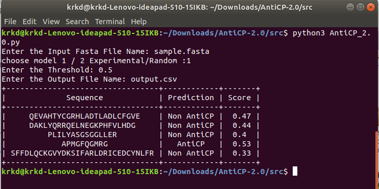

# anticp2
# Introduction
The current study describes a method "AntiCP 2.0" which predicts and design novel Anti-Cancer Peptides (ACPs). Anticancer peptides (ACPs) are part of the antimicrobial peptide group which exhibits anticancer activity. These are small cationic peptides 5-50 amino acids in length. Mostly they possess alpha helix as the secondary structure or folds into beta sheet.
Two datasets were created for developing prediction methods (i) Main dataset and (ii) Alternate dataset. Positive dataset comprises of experimentally verified ACPs and is common in both datasets. In case of main dataset, negative peptides comprises of Antimicrobial Peptides (AMPs) having other activity than anticancer. In case of Alternate dataset, negative peptides comprises of randomly generated peptides using SwissProt Proteins.
Several machine learning models were implemented for developing prediction models such as Support Vector Classifier, Random Forest, ExtraTree, K-Nearest Neighbor, MultiLayer Perceptron and Ridge. Amon all these, ExtraTree Classifier perfromed best and hence is provided here for prediction. The same model is implemented at our website "AntiCP 2.0" too which is available at the link https://webs.iiitd.edu.in/raghava/anticp2/ .
We also benchmarked our method with previous methods and found that our method benchmarked previous methods.

## Instructions for Installation 
User can install the software using the command mentioned below:

```bash
git clone https://github.com/dhruv16146/AntiCP-2.0
```
Once the zip code is downloaded, user needs to enter the folder named "src" by typing the command as shown below:

```bash
cd src
```
Next user needs to install different dependencies in order to run the software. For the same, user needs to run the command mentioned below.
* Here we assume that 'pip' is already installed in the user system. If pip is not installed, user needs to install pip first by using command

```bash
sudo easy_install pip
```
This will install the pip and then user can proceed with the dependencies installation.

```bash
bash Dependencies.bash 
```
Once all the dependencies are installed, user can proceed for the prediction. In order to predict the potency of the peptides user needs to run the command mentioned below. 

```bash
python3 AntiCP_2.0.py
```
Once the command is run, code will ask user to input the name of file having its sequence in FASTA file format. Next, user needs to input the number of model of choice. '1' is for main dataset and '2' is for alternate dataset. Next, user needs to provide threshold value for prediction. This range varies in between 0-1. Once all these inputs are provided, software will predict the output and provides the result whether the peptide is AntiCP or Non-AntiCP along with the prediction score. Example of Input file is provided by the name of "sample.fasta" and screenshot of output is also shown below.

## Interactive

